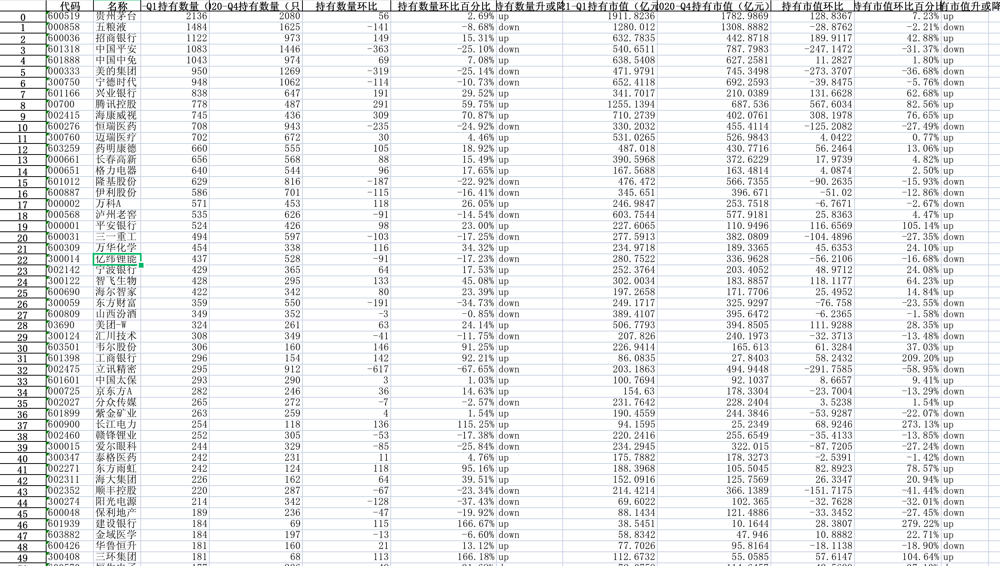
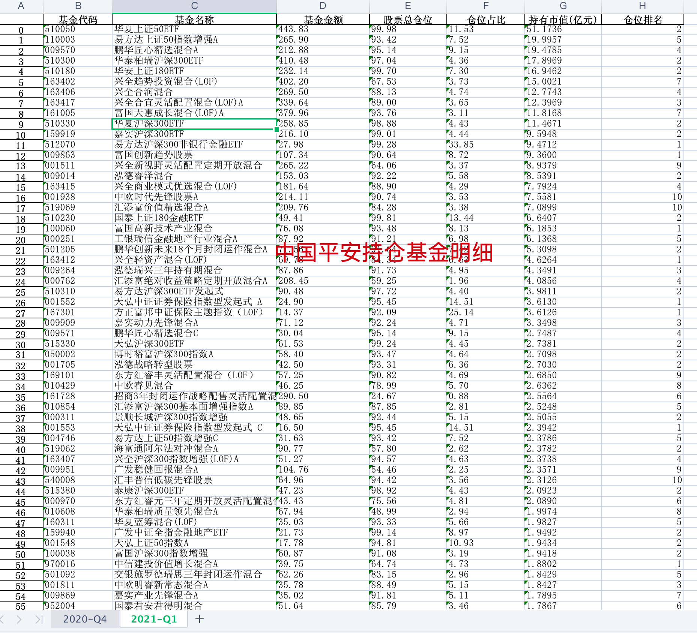

# anchor_outcome

## 介绍
锚点数据分享仓库

## 文件目录介绍

```bash
.
├── funds
    └── high-score-funds.xlsx    # 性价比高名单数据
├── stocks                       # 所有基金持仓股统计名单(包括A股，港股，美股等)
│   ├── A股
│   │   ├── 创业板
│   │   ├── 科创板
│   │   ├── 上证主板
│   │   └── 深证主板
│   ├── other
│   └── 港股
└── strategy
    ├── all_rank.xlsx            # 基金重仓股(全部排行)
    └── top100_rank.xlsx         # 基金重仓股前100股票名单数据

```

## 数据汇总&分析
基于上面的数据，简单做了如下数据汇总
### 性价比高的名单统计

根据基金评级，基金成立时间，基金夏普比例，基金经理从业时间等指标，从几千只股票中选出几十只性比价高的基金，如图所示：


至于”性比价“的定义，大家可以看下面这篇文章
[精心整理，给大家汇总一批性价比高的基金名单](https://mp.weixin.qq.com/s?__biz=MzkyMzI0Njc1Ng==&mid=2247483971&idx=1&sn=a3fd6c71bb42f20d9e17e3f9034a128b&chksm=c1e94b88f69ec29e77cfb2605bef58a158b96150bd1e7615d1f2d4ddfad7cf25b296cd55d941&token=893404419&lang=zh_CN#rd)

### 基金重仓股

基金重仓股 Top50统计，可以分两个维度排序，一个是基金持有数据，一个是持有总市值：



### 个股基金持仓明细
上面我们知道了基金重仓股排名，我们当然也可以统计某一只股票的基金持仓明细，如图所示，中国平安基金持仓明细：


中国平安的基金持仓明细，按基金持有市值排序，其部分数据截图如上

> 所有的数据统计及分析在 [anchor_outcome](https://github.com/jackluson/anchor_outcome) 项目下

欢迎扫描下方微信二维码（anchor_data）,关注获取更多维度统计数据


